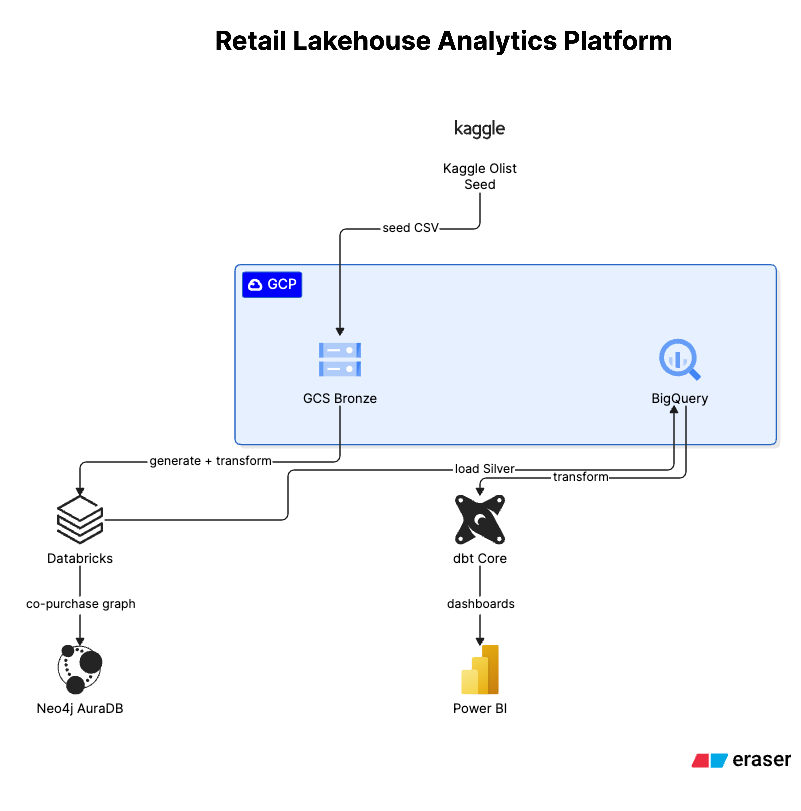
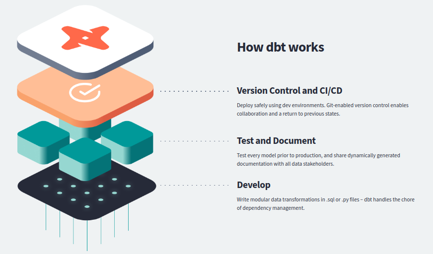
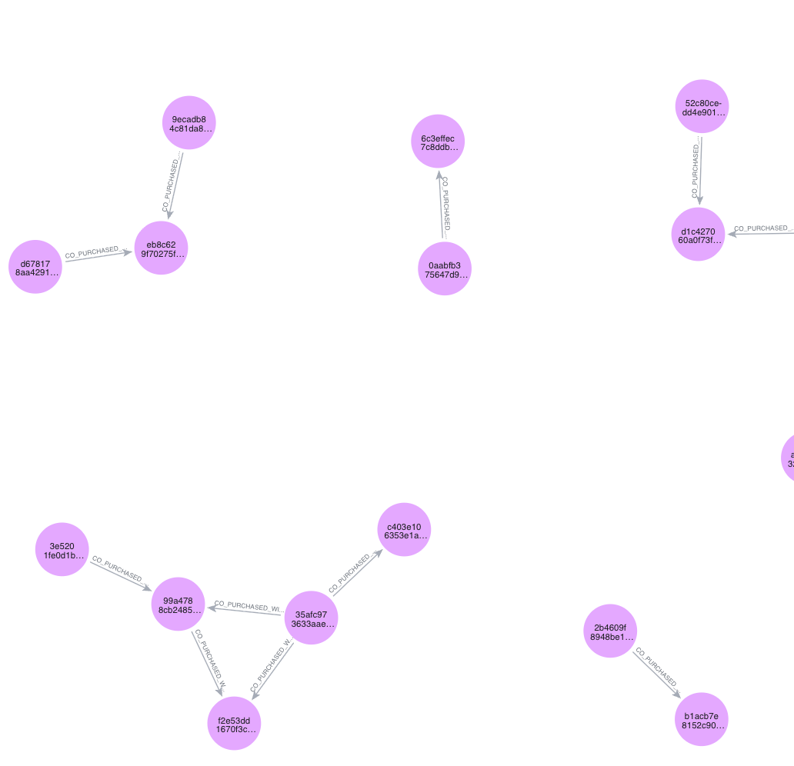

# Retail Lakehouse Analytics Platform

An end-to-end Lakehouse analytics platform simulating a retail/e-commerce data
stack: real seed data → large-scale synthetic generation → Bronze/Silver/Gold →
BI dashboards. Built to demonstrate Medallion Architecture, Delta Lake, Unity
Catalog, and dbt engineering (staging/intermediate/marts, incremental models,
macros, tests, snapshots, CI/CD).

## Tech Stack

| Layer | Technology |
|---|---|
| Data generation | PySpark + Faker, on Databricks |
| Bronze storage | Google Cloud Storage |
| Processing (Silver) | Databricks (Spark) + Delta Lake, Unity Catalog |
| Serving warehouse | BigQuery |
| Transformation (Gold) | dbt Core (`dbt-bigquery`) |
| BI | Power BI |
| Graph analytics | Neo4j AuraDB (optional extension) |
| CI/CD | GitHub Actions |

## Architecture



Kaggle's Olist dataset (~100K real orders) is used as a **seed** — its
distributions (category prices, payment types, review scores, order statuses)
drive a synthetic generator that scales up to millions of fact rows. Databricks
ingests the seed, runs the generator, and transforms Bronze → Silver (Delta
Lake). Silver is loaded into BigQuery, where dbt transforms it into a Gold-layer
star schema. Power BI reads the Gold marts; a Neo4j branch builds a product
co-purchase graph from the real seed data.

## Why Databricks?

The real Olist dataset is only ~100K orders — too small to justify distributed
compute. There's no public retail dataset at millions/billions-of-rows scale
with realistic quality (real data at that scale is proprietary). The standard
data engineering approach: use real data as a **seed** to capture true
distributions, then generate synthetic data at scale with PySpark. Databricks
(Spark + Delta Lake + Unity Catalog) is the compute engine for that generation
and for the Bronze → Silver transform — the layers that actually need
distributed processing.

## Dataset Schema


The Olist seed is 9 CSV files joined through `order_id`, `product_id`,
`seller_id`, `customer_id`, and `zip_code_prefix`. `orders` is the core table;
`order_items`, `payments`, and `reviews` all hang off it via `order_id`.
`customers` and `sellers` link to `geolocation` via `zip_code_prefix` for
geographic analysis.

## GCP Organization

A single GCS bucket holds three prefixes: `seed/` (raw Olist CSVs), `bronze/`
and `silver/` (generator output and transformed Delta tables). BigQuery has two
datasets: `staging_raw` (landing zone Databricks writes Silver into) and
`retail_lakehouse` (where dbt builds staging/intermediate/marts).

## What is dbt, and why?



dbt is the **Transform** layer of ELT — it doesn't move data, it compiles SQL
and lets the warehouse (BigQuery) execute it. It replaces ad-hoc, hand-run SQL
scripts with version-controlled, testable, documented models: every
transformation is a `.sql` file in Git, every model can carry data-quality
tests, and `dbt docs` generates a lineage graph automatically.

## dbt Project Structure

```
staging/      1 model per source table — rename/cast only, no business logic
intermediate/ joins + aggregations (order totals, customer-level rollups)
marts/core/   star schema — dim_customer, dim_product, fact_orders, ...
marts/business/  business-ready marts — daily sales, LTV, RFM segmentation, ...
```

`fact_orders` was converted from a plain table to **incremental**
(`unique_key='order_id'`, `insert_overwrite`, partitioned by
`order_purchase_date`) to demonstrate how large fact tables should be
maintained in production: reprocessing 10M+ rows on every run doesn't scale,
incremental models only touch new/changed data. Note: BigQuery couldn't prune
partitions on this table's dynamic filter (`max(timestamp) from {{ this }}`),
so the byte-scan cost didn't actually drop between runs — a known limitation of
that filter pattern, not a config error.

## CI/CD

GitHub Actions runs `dbt build` on every push to `main`. To keep it fast and
cheap, CI doesn't touch the 10M-row dataset — it seeds a handful of
hand-crafted rows into a dedicated `retail_lakehouse_ci` dataset and runs
seed → run → test → snapshot against that instead. Authentication uses Workload
Identity Federation (no service account key — key creation is blocked by this
project's GCP org policy).

## Neo4j — Product Co-purchase Graph



An optional side branch: a graph of "customers who bought X also bought Y",
built from the **real** seed data (not the synthetic generator — which assigns
products to orders at random, so it carries no real co-purchase signal). The
image above is a zoomed-in section of the graph — each node's label is the
`product_id` (the Olist dataset has no product-name text field, only a
category and a name-length count), connected by `CO_PURCHASED_WITH`
relationships. The graph is made of many small, disconnected clusters rather
than one large network — expected for a marketplace selling unrelated
categories that are rarely bought together.

## Dashboards

See [`dashboards/power_bi/README.md`](dashboards/power_bi/README.md) for the
Power BI dashboards and what each visual shows.

## Project Status

Staging, intermediate, marts, tests, docs, incremental model, snapshots, and
CI/CD are complete. Power BI covers the Executive and Customer dashboards;
Product and Seller dashboards are not built yet.
